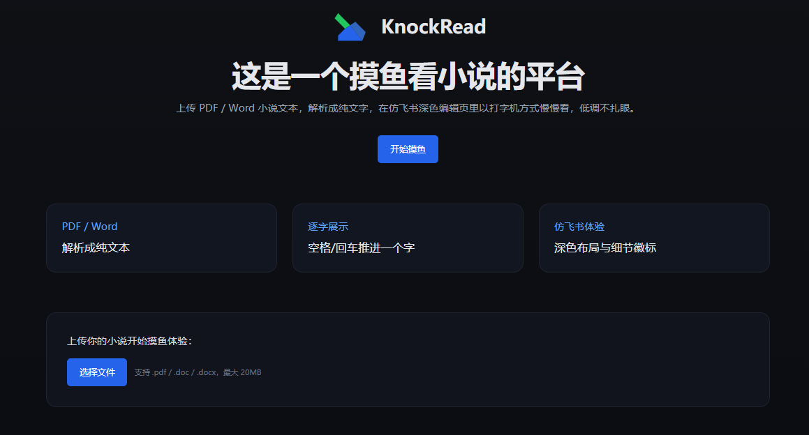

# KnockRead 文档查看工具

<p align="center">
  
</p>

一个基于 Next.js + Tailwind 的在线文档查看/仿写工具：支持上传 PDF / Word（.doc/.docx），后端解析为纯文本，前端以“打字机逐字显示”的交互在仿飞书深色编辑页中展示，并提供标题联动侧栏、保存状态徽标、蓝色选中高亮、顶部工具栏，以及“知识库”下滑面板用于查看并切换后端已解析文件。

## 功能特性
- 文件上传：支持 `.pdf`、`.doc`、`.docx`，大小上限 20MB
- 解析管线：
  - PDF 使用 `pdf-parse`
  - DOCX 使用 `mammoth`
  - DOC 使用 `word-extractor`（临时文件中转，兼容 OLE 格式）
- 展示交互：
  - 空格或回车逐字显示（按一次推进一个字）
  - 逐字阶段支持 Backspace/Delete 回退一个字
  - 完成后正文可编辑，删除依旧严格“一次一个字”
  - 鼠标点击正文先显示蓝色闪烁光标
- 仿飞书布局：
  - 左侧深色侧栏（品牌 Logo、搜索、分组与蓝色高亮的当前文档项）
  - 顶部工具栏（蓝色“分享”、带笔的“编辑 ▾”、铃铛、更多、分隔线、搜索、加号、头像占位）
  - 标题可编辑并与侧栏当前文档项联动
  - 标题旁显示“正在保存…”与“已保存至云端”徽标
 - 知识库：
   - 编辑页左侧“知识库”点击可下滑展开面板
   - 展示后端已解析文件列表，支持点击选择切换当前文档
   - 选择新文档后编辑区重置并从头开始逐字显示

## 快速开始
1. 安装依赖
   ```bash
   npm install
   ```
2. 启动开发环境
   ```bash
   npm run dev
   ```
3. 访问 `http://localhost:3000`，在首页上传 PDF/Word 文件，随后在“已上传文件”列表中选择一个文件并点击“开始摸鱼”进入编辑页；未选择文件时将提示“请选择已上传的文档”。

## 常用命令
- 开发：`npm run dev`
- 构建：`npm run build`
- 生产：`npm start`
- 代码检查：`npm run lint`

## 使用说明
- 首页：
  - 上传完成后，文件会出现在“已上传文件”列表中
  - 选择一个文件并点击“开始摸鱼”进入编辑页；未选择时提示“请选择已上传的文档”
- 编辑页：
  - 空格或回车逐字显示；Backspace/Delete 回退一个字
  - 完成后正文可编辑，删除仍单字粒度；标题编辑不受“单字删除”限制
  - 左侧“知识库”可展开查看后端已解析文件，点击可切换文档；切换后编辑区重置并重新开始逐字显示

## 文件支持与兼容
- `.pdf`：`pdf-parse`
- `.docx`：`mammoth` 抽取纯文本
- `.doc`：优先识别 OLE 头并使用 `word-extractor`；该库需要文件路径，项目中通过写入临时文件解析后删除

## 数据与接口
- 解析后的纯文本会暂存于服务端 `data/docs/*.txt`，元数据记录于 `data/uploads.json`
- 首次调用相关接口时会进行一次清理，确保数据目录与元数据初始化（开发时为临时存储）
- 接口：
  - `POST /api/upload`：上传并解析文件，返回 `{ id, name }`
  - `GET /api/docs`：返回已解析文件列表 `{ list }`
  - `GET /api/docs/:id`：返回指定文档 `{ id, name, text }`

## 目录与关键文件
- 前端页面
  - `pages/index.tsx`：上传入口与解析跳转
  - `pages/editor.tsx`：仿飞书编辑页与逐字交互逻辑
- 后端接口
  - `pages/api/upload.ts`：接收文件并解析为文本，写入 `data/docs/*.txt` 与 `data/uploads.json`
  - `pages/api/docs/index.ts`：返回已上传文档列表
  - `pages/api/docs/[id].ts`：返回指定文档内容
- 解析工具
  - `utils/parsePDF.ts`：PDF 文本抽取
  - `utils/parseDoc.ts`：DOC/DOCX 文本抽取与兼容处理
- 样式
  - `styles/globals.css`：可视光标动画、标题占位

## 故障排查
- 上传 `.doc` 无法展示：
  - 确认文件为传统 OLE `.doc` 或另存为 `.docx`
  - 项目通过临时文件中转给 `word-extractor`，异常会在接口返回错误提示
- Git 上游分支报错（origin/main 不存在）：
  - `git fetch origin`
  - `git ls-remote --heads origin`
  - 若远程为空：`git push -u origin main`
  - 若远程为 `master`：`git branch --set-upstream-to=origin/master main`

## 备注
- Node.js 建议 18+（Next.js 14 运行环境）
- 开发环境下解析数据为临时存储，会在接口首次访问时清理并初始化；编辑页标题会缓存至 `localStorage['docTitle']`，正文文本主要从后端接口加载，在后端不可用时会清理本地缓存以避免展示旧内容
